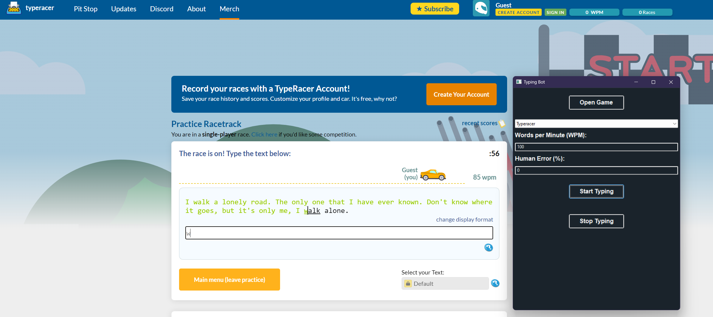

# Typing Bot

## Description
A simple typing bot for [monkeytype.com](https://monkeytype.com) & [typeracer.com](https://play.typeracer.com/). It simulates human typing behavior, allowing you to set the typing speed in WPM and a percentage of errors.

## Features
- Support for Monkeytype & TypeRacer
- Allows customization of typing speed (Words Per Minute) and error rate (%).
- Provides a graphical user interface (GUI) for ease of use.
- Automatically installs chromedriver if not already installed.

## Installation
1. Install Python if you haven't already. You can download it from [python.org](https://www.python.org/downloads/).
2. Clone or download this repository to your local machine.
3. Install the required Python packages using pip: `pip install -r requirements.txt`
4. Make sure you have Chrome older than 115 installed in order for selenium to work, you can download [Chrome 114 here](https://www.filepuma.com/download/google_chrome_64bit_114.0.5735.199-35569/download/).

## Usage
1. Run the main.py script: `python main.py`
2. Once the GUI opens, select either Monkeytype or Typeracer from the dropdown menu then click the "Open Game" button to open the game up in the browser.
2. Enter the desired Words Per Minute (WPM) and Human Error Rate (%) in the input fields.
3. Click the "Start Typing" button when you've entered a game and it will start start typing.
4. To stop typing, click the "Stop Typing" button.